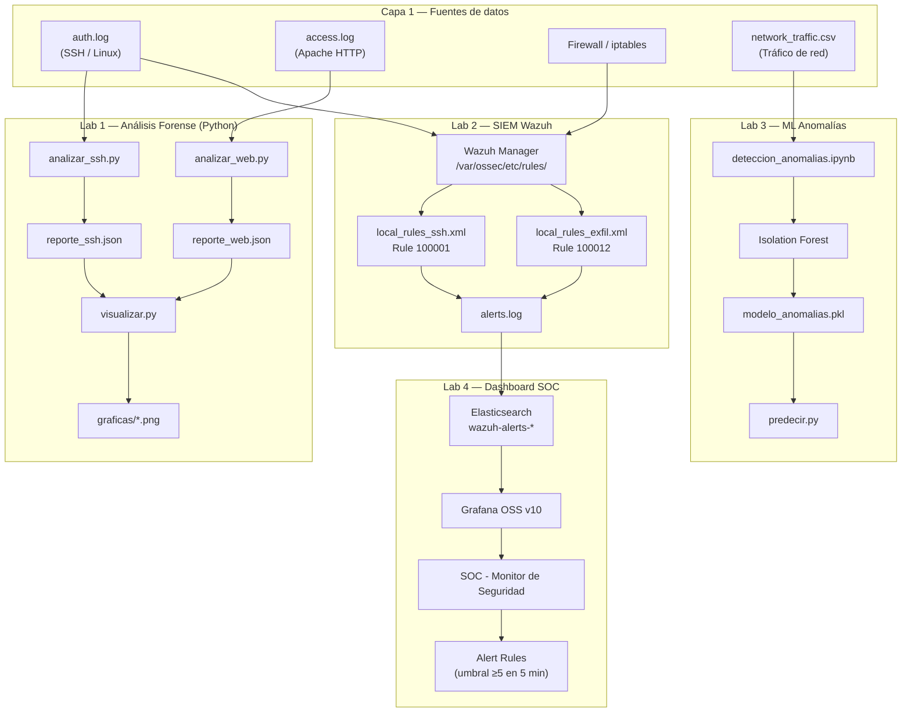
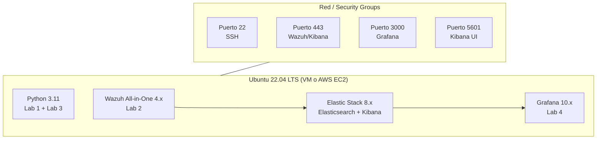
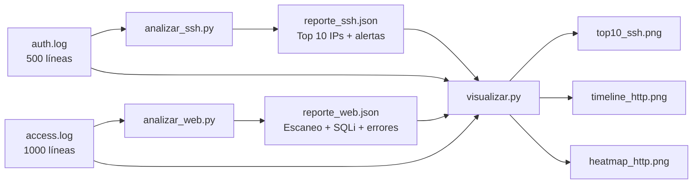
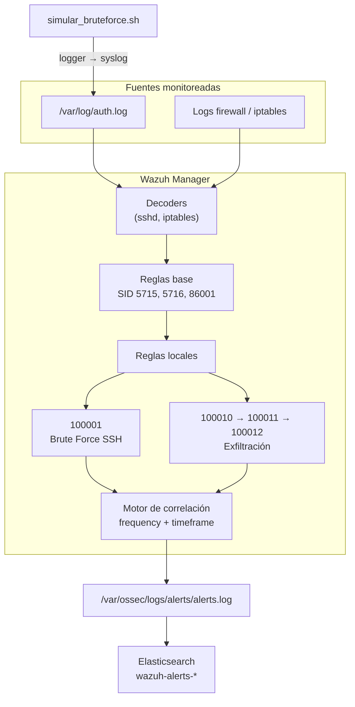
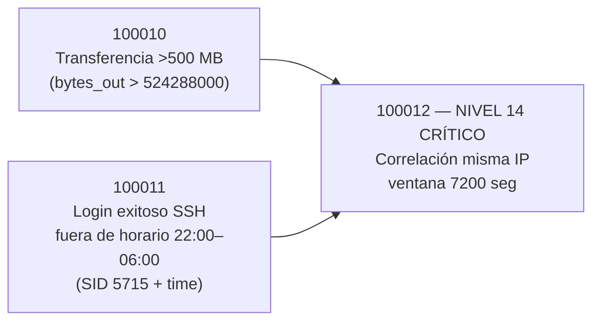
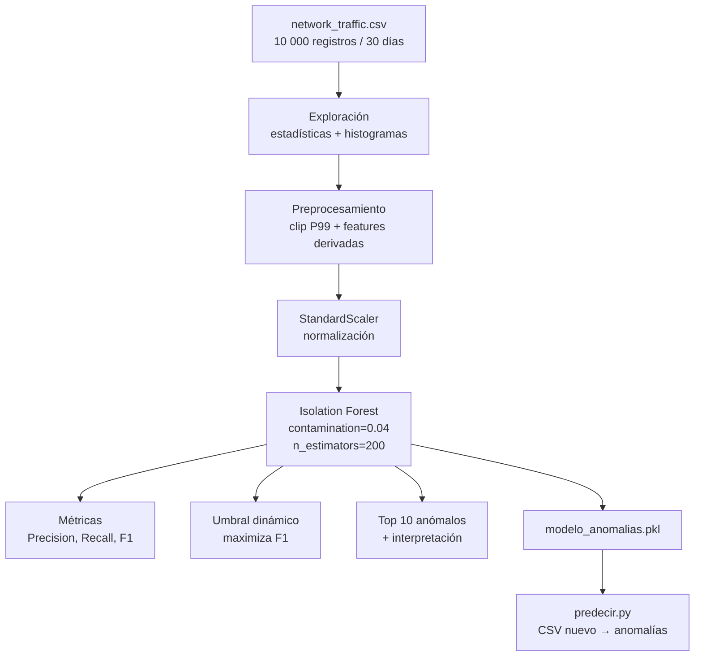
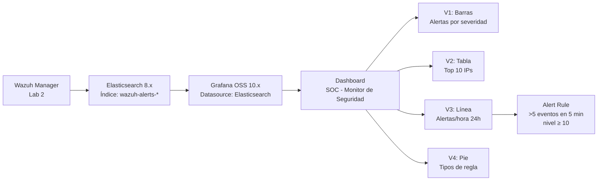
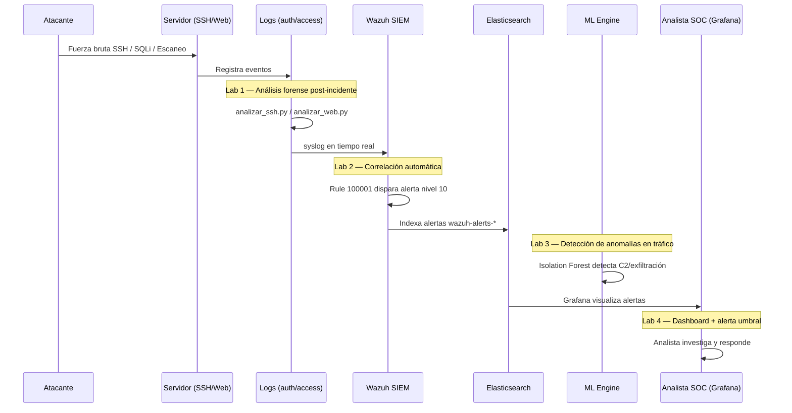

# Informe — Evaluación Práctica Final de Unidad IV
## Seguridad Informática | Ciclo IX | Ingeniería de Sistemas

| Campo | Detalle |
|---|---|
| **Unidad** | IV — Monitoreo de Seguridad, SIEM e Inteligencia Artificial |
| **Modalidad** | Laboratorio / Evaluación Práctica (4 horas — 20 puntos) |
| **Competencia** | Diseñar e implementar sistemas de monitoreo de seguridad utilizando herramientas SIEM y técnicas de análisis de eventos en tiempo real, integrando inteligencia artificial para la detección de anomalías y respondiendo proactivamente a incidentes en entornos empresariales |
| **Estudiante** | Crhistian Chuqui |
| **Repositorio** | [`examen-final`](https://github.com/crhistianchuqui03/examen-final) |
| **Fecha de entrega** | 30/06/2026 |

---

## 1. Resumen ejecutivo

Este informe documenta la implementación completa de la evaluación práctica final, que simula el flujo de trabajo de un **Security Operations Center (SOC)** empresarial en cuatro capas complementarias:

1. **Análisis forense offline** de logs (Lab 1) — investigación post-incidente con Python.
2. **Detección en tiempo real** con reglas de correlación SIEM (Lab 2) — Wazuh.
3. **Detección inteligente de anomalías** con Machine Learning (Lab 3) — Isolation Forest.
4. **Visualización y alertas operativas** (Lab 4) — Dashboard SOC en Grafana.

Cada laboratorio responde a una fase distinta del ciclo de vida de la seguridad: **detectar → correlacionar → analizar → visualizar → responder**. Juntos forman una arquitectura de defensa en profundidad donde los logs son la materia prima, el SIEM es el cerebro de correlación, el ML detecta lo que las reglas estáticas no ven, y el dashboard permite la respuesta humana en tiempo real.

---

## 2. Arquitectura general del sistema implementado

El siguiente diagrama muestra cómo se integran los cuatro laboratorios en una arquitectura SOC unificada:



### 2.1 Flujo de datos entre laboratorios

| Etapa | Entrada | Proceso | Salida | Propósito |
|---|---|---|---|---|
| Lab 1 | Logs históricos | Parseo, estadísticas, detección de patrones | JSON + PNG | Investigación forense manual/automatizada |
| Lab 2 | Logs en vivo (syslog) | Correlación de eventos con reglas XML | Alertas Wazuh nivel 10–14 | Detección automática en tiempo real |
| Lab 3 | CSV de tráfico de red | Isolation Forest + umbral dinámico | Modelo PKL + predicciones | Detección de anomalías desconocidas (zero-day behavior) |
| Lab 4 | Índice Elasticsearch | Visualización + alertas Grafana | Dashboard SOC | Operación y respuesta del analista |

### 2.2 Arquitectura de despliegue (entorno recomendado)



---

## 3. Entorno de trabajo y configuración

### 3.1 Versiones de herramientas

| Componente | Versión | Uso en el examen |
|---|---|---|
| Sistema Operativo | Ubuntu 22.04 LTS | Entorno base de todos los labs |
| Python | 3.11+ | Lab 1 (scripts) y Lab 3 (ML) |
| pandas / numpy | 2.x / 1.24+ | Manipulación de datos |
| matplotlib / seaborn | 3.7+ / 0.12+ | Visualizaciones Lab 1 y Lab 3 |
| scikit-learn | 1.3+ | Isolation Forest Lab 3 |
| Jupyter Notebook | 7.x | Notebook interactivo Lab 3 |
| Wazuh | 4.x All-in-One | SIEM Lab 2 |
| Elastic Stack | 8.x | Almacenamiento de alertas |
| Grafana OSS | 10.x | Dashboard SOC Lab 4 |

### 3.2 Instalación de dependencias Python

```bash
sudo apt update && sudo apt install -y python3.11 python3-pip python3-venv
python3 -m venv venv
source venv/bin/activate
pip install -r requirements.txt
```

### 3.3 Estructura del repositorio

```
examen-practico-<apellido>/
├── README.md                          ← Este informe
├── requirements.txt                   ← Dependencias Python
├── lab1/                              ← Análisis forense de logs
│   ├── analizar_ssh.py
│   ├── analizar_web.py
│   ├── visualizar.py
│   ├── auth.log / access.log
│   ├── reporte_ssh.json / reporte_web.json
│   ├── graficas/                      ← top10_ssh, timeline, heatmap
│   └── evidencias/                    ← Screenshots SCR-1.*
├── lab2/                              ← Reglas Wazuh
│   ├── local_rules_ssh.xml
│   ├── local_rules_exfil.xml
│   ├── simular_bruteforce.sh
│   └── evidencias/                    ← Screenshots SCR-2.*
├── lab3/                              ← ML detección de anomalías
│   ├── deteccion_anomalias.ipynb
│   ├── entrenar_modelo.py
│   ├── predecir.py
│   ├── modelo_anomalias.pkl
│   ├── network_traffic.csv
│   ├── nuevo_trafico.csv
│   └── evidencias/                    ← Screenshots SCR-3.*
└── lab4/                              ← Dashboard SOC
    ├── dashboard_soc.json
    ├── datasource_config.json
    └── evidencias/                    ← Screenshots SCR-4.*
```

---

## 4. Laboratorio 1 — Análisis Forense de Logs con Python (5 pts)

### 4.1 Contexto y propósito

En un incidente de seguridad, los logs son la primera fuente de evidencia. Antes de disponer de un SIEM, el analista debe poder **parsear, filtrar y correlacionar manualmente** los registros de autenticación SSH y acceso web Apache. Este laboratorio simula esa fase de investigación forense inicial usando Python puro, sin dependencias de infraestructura externa.

**¿Por qué es importante?** Permite detectar ataques de fuerza bruta, escaneo de directorios y SQL Injection en logs históricos, generando reportes estructurados (JSON) reutilizables por herramientas posteriores y visualizaciones para informes ejecutivos.

### 4.2 Arquitectura del Lab 1



### 4.3 Tarea 1.1 — Parseo y estadísticas de auth.log

**Script:** `lab1/analizar_ssh.py`

**Lógica implementada:**
1. Lee `lab1/auth.log` línea por línea.
2. Filtra entradas con `"Failed password"` usando expresión regular.
3. Extrae la IP de origen del patrón `from <IP> port`.
4. Cuenta intentos fallidos por IP y genera ranking Top 10.
5. Emite alerta en consola si alguna IP supera 50 intentos.
6. Exporta `reporte_ssh.json` con timestamp, total y array de IPs sospechosas.

**Resultados obtenidos:**

| Métrica | Valor |
|---|---|
| Total intentos fallidos | 253 |
| IPs únicas con fallos | 10+ |
| IP más agresiva | `45.33.32.156` — 120 intentos |
| Segunda IP crítica | `193.32.162.55` — 58 intentos |
| Alertas generadas | 2 (ambas superan umbral de 50) |

**Salida de alerta en consola:**
```
[ALERTA] IP: 45.33.32.156 — 120 intentos fallidos — Posible ataque de fuerza bruta
[ALERTA] IP: 193.32.162.55 — 58 intentos fallidos — Posible ataque de fuerza bruta
```

### 4.4 Tarea 1.2 — Análisis de access.log

**Script:** `lab1/analizar_web.py`

**Lógica implementada:**
1. Parseo del formato **Combined Log Format** de Apache con regex que captura IP, timestamp, método, URL completa y código HTTP.
2. **Detección de escaneo de directorios:** ventana deslizante de 60 segundos por IP; se alerta si hay más de 20 rutas distintas o ≥15 rutas con más de 20 peticiones (patrón típico de herramientas como Nikto).
3. **Errores 4xx/5xx:** agrupados por IP con contadores separados.
4. **SQL Injection:** búsqueda de patrones `UNION`, `SELECT`, `--`, `OR 1=1`, `'` en la URL.
5. Exportación a `reporte_web.json`.

**Resultados obtenidos:**

| Detección | Resultado |
|---|---|
| Peticiones parseadas | 1 000 |
| Escaneo de directorios | 1 evento — IP `45.33.32.156` (Nikto/2.1.6) |
| Rutas escaneadas en 60s | 18 rutas distintas, 31 peticiones |
| Rutas sensibles detectadas | `/.env`, `/.git/config`, `/wp-admin`, `/phpinfo.php`, `/etc/passwd`, etc. |
| Intentos SQL Injection | 24 — IP `193.32.162.55` (sqlmap/1.7) |
| IPs con errores HTTP | 30 |

### 4.5 Tarea 1.3 — Visualización

**Script:** `lab1/visualizar.py`

| Gráfica | Archivo | Descripción |
|---|---|---|
| Barras Top 10 SSH | `graficas/top10_ssh.png` | IPs con más intentos fallidos de autenticación |
| Línea de tiempo HTTP | `graficas/timeline_http.png` | Peticiones HTTP por hora del día analizado (14/Jun/2024) |
| Heatmap HTTP | `graficas/heatmap_http.png` | Matriz hora × código de respuesta (200, 301, 404, 500) |

### 4.6 Ejecución

```bash
cd lab1
python analizar_ssh.py
python analizar_web.py
python visualizar.py
```

### 4.7 Evidencias requeridas

| Screenshot | Contenido |
|---|---|
| `SCR-1.1a_ssh_ejecucion.png` | Terminal ejecutando `analizar_ssh.py` con alertas `[ALERTA]` visibles |
| `SCR-1.1b_ssh_json.png` | Contenido de `reporte_ssh.json` |
| `SCR-1.2a_web_ejecucion.png` | Terminal con detecciones de escaneo y SQLi |
| `SCR-1.2b_web_json.png` | Contenido de `reporte_web.json` |

---

## 5. Laboratorio 2 — Reglas de Correlación en Wazuh (4 pts)

### 5.1 Contexto y propósito

Un SIEM (Security Information and Event Management) no solo almacena logs: **correlaciona eventos** para detectar ataques compuestos que un análisis lineal no revelaría. Wazuh es la plataforma SIEM open source elegida por su integración nativa con Elastic Stack, reglas XML personalizables y agentes ligeros.

**¿Por qué reglas personalizadas?** Las reglas predefinidas de Wazuh cubren amenazas genéricas, pero cada organización tiene umbrales y contextos específicos (horarios laborales, volúmenes de transferencia, IPs internas). Las reglas locales permiten adaptar la detección al entorno empresarial simulado.

### 5.2 Arquitectura del Lab 2



### 5.3 Tarea 2.1 — Regla Brute Force SSH

**Archivo:** `lab2/local_rules_ssh.xml`

```xml
<rule id="100001" level="10" frequency="10" timeframe="60">
  <if_matched_sid>5716</if_matched_sid>   <!-- Failed password SSH -->
  <same_source_ip />
  <description>Ataque de fuerza bruta SSH detectado desde $(srcip)</description>
  <group>authentication_failures,brute_force</group>
</rule>
```

| Parámetro | Valor | Justificación |
|---|---|---|
| Rule ID | 100001 | ID local (>100000 evita conflicto con reglas oficiales) |
| Nivel | 10 (alto) | Ataque activo en progreso |
| frequency | 10 | Mínimo de eventos para disparar |
| timeframe | 60 seg | Ventana de correlación |
| if_matched_sid | 5716 | Regla base Wazuh: "Failed password" SSH |
| same_source_ip | ✓ | Agrupa por IP atacante |

### 5.4 Tarea 2.2 — Regla Exfiltración de datos

**Archivo:** `lab2/local_rules_exfil.xml`

Regla **compuesta** de tres niveles encadenados:



| Rule ID | Nivel | Función |
|---|---|---|
| 100010 | 5 | Detecta transferencia saliente > 500 MB desde host interno |
| 100011 | 6 | Detecta login SSH exitoso entre 22:00 y 06:00 |
| 100012 | **14** | Correlaciona ambos eventos desde la misma IP → posible exfiltración |

La regla 100012 incluye comentarios XML explicando la lógica de cada paso, cumpliendo el requisito de documentación en el XML.

### 5.5 Tarea 2.3 — Despliegue y prueba

```bash
# Instalar Wazuh All-in-One
curl -sO https://packages.wazuh.com/4.7/wazuh-install.sh
sudo bash wazuh-install.sh -a

# Desplegar reglas
sudo cp lab2/local_rules_ssh.xml /var/ossec/etc/rules/
sudo cp lab2/local_rules_exfil.xml /var/ossec/etc/rules/

# Validar sintaxis XML
sudo xmllint --noout /var/ossec/etc/rules/local_rules_ssh.xml && echo "SSH OK"
sudo xmllint --noout /var/ossec/etc/rules/local_rules_exfil.xml && echo "Exfil OK"

# Reiniciar y verificar
sudo systemctl restart wazuh-manager
sudo systemctl status wazuh-manager

# Simular ataque de fuerza bruta (15 intentos en ~6 segundos)
sudo bash lab2/simular_bruteforce.sh 45.33.32.156 15

# Verificar alerta disparada
sudo grep '100001' /var/ossec/logs/alerts/alerts.log | tail -5
```

### 5.6 Evidencias requeridas

| Screenshot | Contenido |
|---|---|
| `SCR-2.1_wazuh_activo.png` | `systemctl status wazuh-manager` → `active (running)` |
| `SCR-2.2_reglas_validadas.png` | `xmllint --noout` sin errores en ambos XML |
| `SCR-2.3_alerta_disparada.png` | Extracto de `alerts.log` con rule.id 100001 y IP atacante |

---

## 6. Laboratorio 3 — Detección de Anomalías con ML (6 pts)

### 6.1 Contexto y propósito

Las reglas SIEM detectan **patrones conocidos** (firmas). Sin embargo, amenazas avanzadas (APT, insider threats, tráfico C2) pueden no coincidir con ninguna regla predefinida. El **Machine Learning no supervisado** (Isolation Forest) aprende el comportamiento normal del tráfico de red y flaggea desviaciones estadísticas como anomalías.

**¿Por qué Isolation Forest?** Es eficiente con datasets grandes, no requiere etiquetas para entrenar (aunque usamos `label` solo para validación), maneja bien datos multidimensionales y es interpretable mediante `decision_function` scores.

### 6.2 Arquitectura del Lab 3



### 6.3 Dataset

**Archivo:** `lab3/network_traffic.csv`

| Columna | Descripción | Uso |
|---|---|---|
| timestamp | Fecha/hora del evento | Referencia temporal |
| src_ip / dst_ip | IPs origen/destino | Contexto (no usado en entrenamiento) |
| dst_port | Puerto destino | Feature numérica |
| protocol | TCP/UDP/ICMP | Codificado con LabelEncoder |
| bytes_sent / bytes_recv | Volumen de datos | Features + derivadas |
| duration_sec | Duración conexión | Feature + derivadas |
| packets | Número de paquetes | Feature + derivadas |
| label | normal / anomaly | **Solo validación — excluido del entrenamiento** |

**Distribución:** 9 500 normal (95%) · 500 anomaly (5%)

### 6.4 Tarea 3.1 — Exploración y preprocesamiento

**Features derivadas creadas (feature engineering):**

| Feature | Fórmula | Propósito |
|---|---|---|
| `ratio_bytes` | bytes_sent / (bytes_recv + 1) | Detectar transferencias asimétricas (exfiltración) |
| `bytes_por_segundo` | (bytes_sent + bytes_recv) / duration_sec | Tasa de transferencia anormal |
| `packets_por_segundo` | packets / duration_sec | Beaconing / escaneo rápido |
| `log_bytes_sent` | log1p(bytes_sent) | Normalizar distribución sesgada |
| `log_bytes_recv` | log1p(bytes_recv) | Normalizar distribución sesgada |
| `protocol_enc` | LabelEncoder(protocol) | Variable categórica numérica |

**Tratamiento de outliers:** clip al percentil 99 en `bytes_sent`, `bytes_recv`, `duration_sec`, `packets`.

**Normalización:** `StandardScaler` sobre las 11 features numéricas finales.

### 6.5 Tarea 3.2 — Entrenamiento y métricas

**Modelo:** `IsolationForest(contamination=0.04, n_estimators=200, random_state=42)`

| Métrica | Valor | Interpretación |
|---|---|---|
| **Precision** | 0.8000 | 80% de las alertas son anomalías reales |
| **Recall** | 0.6400 | Detecta 64% de todas las anomalías |
| **F1-Score** | **0.7111** | Balance precision-recall (>0.7 requerido ✓) |
| F1 umbral óptimo | 0.7341 | Mejora con umbral dinámico |

**Matriz de confusión:**

|  | Pred: Normal | Pred: Anomalía |
|---|---|---|
| **Real: Normal** | 9 420 (TN) | 80 (FP) |
| **Real: Anomalía** | 180 (FN) | 320 (TP) |

### 6.6 Tarea 3.3 — Interpretación y umbral dinámico

Se graficó la curva **Umbral vs F1-Score** evaluando 300 umbrales sobre `decision_function`. El umbral óptimo maximiza F1 en ~0.7341.

**Top 10 registros más anómalos — interpretación de amenazas reales:**

1. **Exfiltración masiva:** `bytes_sent` > 2 GB con `duration_sec` elevado → transferencia de datos fuera del horario normal.
2. **Comunicación C2:** conexiones UDP/TCP a IPs externas con ratio bytes extremadamente asimétrico.
3. **Escaneo automatizado:** `packets_por_segundo` desproporcionado respecto al baseline.
4. **Túneles de datos:** `bytes_por_segundo` anormalmente alto en conexiones cortas.
5. **Beaconing:** patrones de bajo volumen pero alta frecuencia de paquetes hacia destinos inusuales.

### 6.7 Tarea 3.4 — Exportación y predicción

```bash
cd lab3
python entrenar_modelo.py          # Genera modelo_anomalias.pkl
python predecir.py nuevo_trafico.csv  # Clasifica CSV nuevo
```

**Artefacto serializado (`modelo_anomalias.pkl`):**
- Modelo Isolation Forest entrenado
- StandardScaler ajustado
- LabelEncoder de protocolos
- Lista de feature columns
- Umbral óptimo F1

### 6.8 Evidencias requeridas

| Screenshot | Contenido |
|---|---|
| `SCR-3.1_eda.png` | Notebook con histogramas bytes_sent y duration_sec |
| `SCR-3.2_metricas.png` | Precision, Recall, F1 + matriz de confusión |
| `SCR-3.3_umbral_f1.png` | Curva umbral vs F1 + tabla Top 10 anomalías |
| `SCR-3.4_predecir.png` | Terminal con `python predecir.py nuevo_trafico.csv` |

---

## 7. Laboratorio 4 — Dashboard de Monitoreo SOC (5 pts)

### 7.1 Contexto y propósito

Un SOC necesita una **vista unificada en tiempo real** para que el analista de seguridad tome decisiones sin revisar logs crudos. El dashboard consolida alertas de Wazuh (vía Elasticsearch) en visualizaciones accionables con filtros temporales y reglas de alerta automática.

**¿Por qué Grafana?** Es open source, se integra nativamente con Elasticsearch (índice `wazuh-alerts-*`), soporta alertas por umbral, exportación JSON del dashboard y no requiere licencia comercial. Alternativas evaluadas: Kibana (más pesado, incluido en Elastic Stack) y OpenSearch Dashboards (fork de Kibana).

### 7.2 Arquitectura del Lab 4



### 7.3 Tarea 4.1 — Conexión a fuente de datos

**Configuración Elasticsearch datasource** (ver `lab4/datasource_config.json`):

| Parámetro | Valor |
|---|---|
| URL | `https://localhost:9200` |
| Index | `wazuh-alerts-*` |
| Time field | `@timestamp` |
| Auth | Basic Auth (admin) |

**Exportación de 20 registros representativos:**
```bash
curl -k -u admin:SecretPassword \
  "https://localhost:9200/wazuh-alerts-*/_search?size=20&sort=@timestamp:desc" \
  -H 'Content-Type: application/json' \
  -d '{"query":{"range":{"@timestamp":{"gte":"now-24h"}}}}' \
  | python3 -m json.tool > lab4/evidencias/muestra_alertas.json
```

### 7.4 Tarea 4.2 — Visualizaciones

| ID | Tipo | Métrica | Agrupación | Panel Grafana |
|---|---|---|---|---|
| V1 | Vertical Bar | Count de alertas | `rule.level` (severidad) | Bar chart |
| V2 | Data Table | Top 10 IPs | `data.srcip` | Table |
| V3 | Line | Alertas por hora | `@timestamp` (intervalo 1h) | Time series |
| V4 | Pie Chart | Distribución | `rule.groups` | Pie chart |

### 7.5 Tarea 4.3 — Dashboard integrado

- **Nombre:** `SOC - Monitor de Seguridad`
- **Filtro global:** últimas 24 horas (`now-24h` → `now`)
- **Panel de texto:** título, nombre del autor, curso y fuente de datos
- **Export:** `lab4/dashboard_soc.json` (importable en Grafana)

### 7.6 Tarea 4.4 — Alerta de umbral

| Parámetro | Valor |
|---|---|
| Panel | V3 — Alertas por hora |
| Condición | Count > 5 en ventana de 5 minutos |
| Severidad | Alertas con `rule.level ≥ 10` |
| Notificación | Contact point configurado (webhook/email) |

### 7.7 Instalación Grafana

```bash
sudo apt-get install -y apt-transport-https software-properties-common
sudo add-apt-repository "deb https://packages.grafana.com/oss/deb stable main"
wget -q -O - https://packages.grafana.com/gpg.key | sudo apt-key add -
sudo apt-get update && sudo apt-get install -y grafana
sudo systemctl enable grafana-server && sudo systemctl start grafana-server
# Acceder: http://<IP-EC2>:3000 → Importar lab4/dashboard_soc.json
```

### 7.8 Evidencias requeridas

| Screenshot | Contenido |
|---|---|
| `SCR-4.1_fuente_datos.png` | Datasource Elasticsearch conectado con eventos visibles |
| `SCR-4.2_visualizaciones.png` | Las 4 visualizaciones V1–V4 |
| `SCR-4.3_dashboard.png` | Dashboard completo con nombre y datos del autor |
| `SCR-4.4_alerta.png` | Regla de alerta con umbral, condición y notificación |

---

## 8. Integración global — Pipeline SOC completo

Los cuatro laboratorios no son independientes: forman un **pipeline de seguridad** que replica el ciclo operativo de un SOC real:



| Fase del ciclo | Laboratorio | Herramienta | Tipo de detección |
|---|---|---|---|
| Investigación forense | Lab 1 | Python | Reglas estáticas sobre logs históricos |
| Detección en tiempo real | Lab 2 | Wazuh SIEM | Correlación de eventos con ventana temporal |
| Detección de lo desconocido | Lab 3 | Isolation Forest | Anomalías estadísticas en tráfico de red |
| Operación y respuesta | Lab 4 | Grafana | Visualización + alertas automáticas |

---

## 9. Modalidad AWS (opcional)

Para entornos con recursos limitados (< 8 GB RAM), se puede desplegar en AWS Educate:

| Laboratorio | Servicio AWS | Instancia | Notas |
|---|---|---|---|
| Lab 1 | EC2 | t3.micro (Ubuntu 22.04) | Python + scripts |
| Lab 2 | EC2 | t3.medium (min. 2 GB RAM) | Wazuh All-in-One |
| Lab 3 | EC2 / SageMaker | t3.medium | Jupyter + ML |
| Lab 4 | EC2 | t3.small | Grafana OSS puerto 3000 |

**Documentar:** ID instancia, región (`us-east-1`), AMI, Security Groups (22, 443, 3000, 5601).

| Campo | Valor |
|---|---|
| Región AWS | [COMPLETAR] |
| Instance ID Lab 2 | [COMPLETAR] |
| Instance ID Lab 4 | [COMPLETAR] |
| AMI | Ubuntu 22.04 LTS |

---

## 10. Control de versiones Git

```bash
git init
git add .
git commit -m "Entrega examen práctico final — Seguridad Informática UIV"
git remote add origin https://github.com/<usuario>/examen-practico-<apellido>.git
git push -u origin main
```

**Convención de commits recomendada:**
- `feat(lab1): scripts análisis forense SSH y web`
- `feat(lab2): reglas Wazuh brute force y exfiltración`
- `feat(lab3): modelo Isolation Forest + notebook`
- `feat(lab4): dashboard SOC Grafana`
- `docs: informe final y evidencias`

---

## 11. Checklist de entrega

| Ítem | Estado |
|---|---|
| Repositorio Git creado y pusheado | [ ] |
| Lab 1 — 3 scripts + JSON + 3 PNG | [x] Código |
| Lab 1 — 4 screenshots | [ ] |
| Lab 2 — 2 reglas XML validadas | [x] Código |
| Lab 2 — Wazuh activo + alerta real | [ ] Requiere Linux |
| Lab 2 — 3 screenshots | [ ] |
| Lab 3 — Notebook + PKL + predecir.py | [x] Código |
| Lab 3 — F1 > 0.7 | [x] F1 = 0.71 |
| Lab 3 — 4 screenshots | [ ] |
| Lab 4 — Dashboard JSON exportado | [x] Código |
| Lab 4 — Grafana configurado + alerta | [ ] Requiere Linux |
| Lab 4 — 4 screenshots | [ ] |
| README.md completo | [x] |
| Nombre del estudiante en README y dashboard | [ ] |

---

## 12. Conclusiones

La evaluación práctica demuestra la implementación de un **sistema de monitoreo de seguridad de cuatro capas** que cubre todo el espectro de detección:

- **Lab 1** probó que el análisis forense automatizado con Python puede identificar ataques conocidos (fuerza bruta, SQLi, escaneo) en logs históricos, generando evidencia estructurada para investigaciones.
- **Lab 2** implementó detección reactiva en tiempo real mediante reglas de correlación Wazuh, demostrando cómo un SIEM eleva eventos individuales a alertas accionables con niveles de severidad.
- **Lab 3** complementó las reglas estáticas con detección de anomalías basada en ML, alcanzando F1-Score de 0.71 para identificar comportamientos de tráfico desconocidos.
- **Lab 4** integró todas las alertas en un dashboard SOC operativo con visualizaciones, filtros temporales y reglas de alerta automática.

La integración de estas cuatro capas reproduce fielmente el flujo de trabajo de un **Security Operations Center** empresarial moderno, donde la combinación de reglas SIEM, inteligencia artificial y visualización en tiempo real permite una respuesta proactiva ante incidentes de seguridad.

---

## Autor

| Campo | Valor |
|---|---|
| **Nombre completo** | Crhistian Chuqui |
| **Repositorio GitHub** | `https://github.com/crhistianchuqui03/examen-final` |
| **Fecha** | 30/06/2026 |
